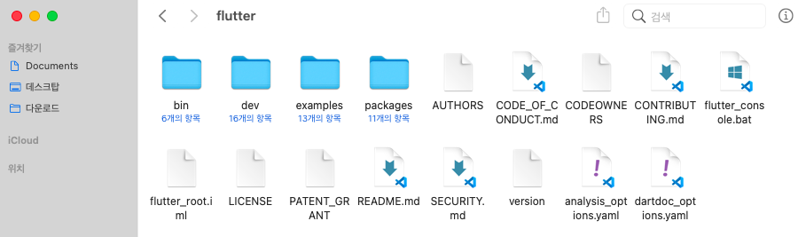

# Flutter

- KITRI 강의를 통해 배운 내용을 정리하기 위해 작성된 자료입니다.
- 잘못된 내용, 추가가 필요한 내용은 이메일을 통해 전달바랍니다.

## 모바일 앱 개발
- 네이티브 앱 
  - iOS의 Object-C 혹은 Swift, Android의 java 혹은 kotlin를 이용하여 해당 운영 체제에 가장 적합하고 일반적인 앱 개발 방법
  - 해당 운영 체제에 맞는 API를 이용하여 구현하기 떄문에 기기가 가진 고유의 모든 기능을 사용 가능, 다른 방식에 비해 성능적으로 우수
  - But, 두 가지 주요 운영체제(Android, iOS)를 모두 능숙히 다루는 사람이 적고, 각각의 전문가를 필요로 한다는 점에서 규모가 작은, 경험이 충분하지 않은 그룹의 경우 네이티브 앱을 제공하기 어려움

- 하이브리드 앱
  - 통상적인 웹 개발을 형태를 그대로 가지고 온 방법, 웹뷰를 이용
  - Ionic이 대표적, 빠른개발이 가능하지만 성능 측면에서 미흡

- 크로스플랫폼 앱
  - 네이티브가 아닌 언어로 코딩한 후, 이를 각각의 운영체제에 맞게끔 변환시켜주는 플랫폼을 이용한 앱
  - 리액트 네이티브와 flutter(dart)가 이에 속함. 
  - 이후 리액트 네이티브와 비교 예정

## 환경 설정
- 개발 PC 사양 및 환경
  - Android와 iOS 모두 사용하지 않고, 제한적이지만 웹 테스트 환경에서 개발을 진행
  - [참고 링크](https://medium.com/flutter-korea/flutter-vscode%EB%A1%9C-%EC%8B%9C%EC%9E%91%ED%95%98%EA%B8%B0-edbe44a178c5)
```
운영체제     macOS Big Sur 11.2.1
모델명       MacBook Air(13-inch, Early 2015)
프로세서     1.6GHz 듀얼 코어 Intel Core i5
메모리       8GB 1600 MHz DDR3
그래픽       Intel HD Graphics 6000 1536 MB

기타        Android Studio & Xcode  (미사용)
          iOS 시뮬레이터, Android 에뮬레이터 (미사용)
          VSCode 사용, 크롬 웹 환경을 통해 테스트 진행 
```

1. Flutter [SDK 다운 링크](https://flutter-ko.dev/) (2021년 4월 기준)
<br><br>

2. 각 PC에 맞는 OS 선택 
<br><br>

3. flutter_macos_2.0.5-stable.zip 다운로드
<br><br>

4. SDK를 저장할 장소를 선택하여 압축 해제(압축 해제 시)
<br><br>

5. 환경변수에 flutter/bin 추가
```sh
export PATH="$PATH:`pwd`/flutter/bin"
```

6. flutter doctor 실행
<br>설치 혹은 설정이 필요하다고 필요하다고 생각되는 부분은 진행
<br><br>

7. VSCode [설치 링크](https://code.visualstudio.com/)
<br>각 운영 체제에 맞는 버전 설치

8. extension에서 flutter플러그인을 설치 후 재 실행
<br><br>

-----------

## [hello_flutter](/hello_flutter)
- Flutter의 가장 기본이 되는 프로젝트로 이 Git 에 저장된 모든 flutter 프로젝트는 해당 프로젝트를 수정하여 발전시킨 형태

## [basic_concept_flutter](/basic_concept_flutter)
- Flutter의 기본 개념을 익히기 위해 작성한 프로젝트

## [my_card_flutter](/my_card_flutter)
- 로컬 PC의 폰트, 이미지 사용하기 

## [dice_flutter](/dice_flutter)
- stateful widget 생성 연습, 주사위 게임 프로젝트

## [xylophone_flutter](/xylophone_flutter)
- 패키지 활용 연습, 실로폰 프로젝트

## [weather_flutter](/weather_flutter)
- 화면 간 이동 및 날씨 API 활용, 날씨 앱 프로젝트