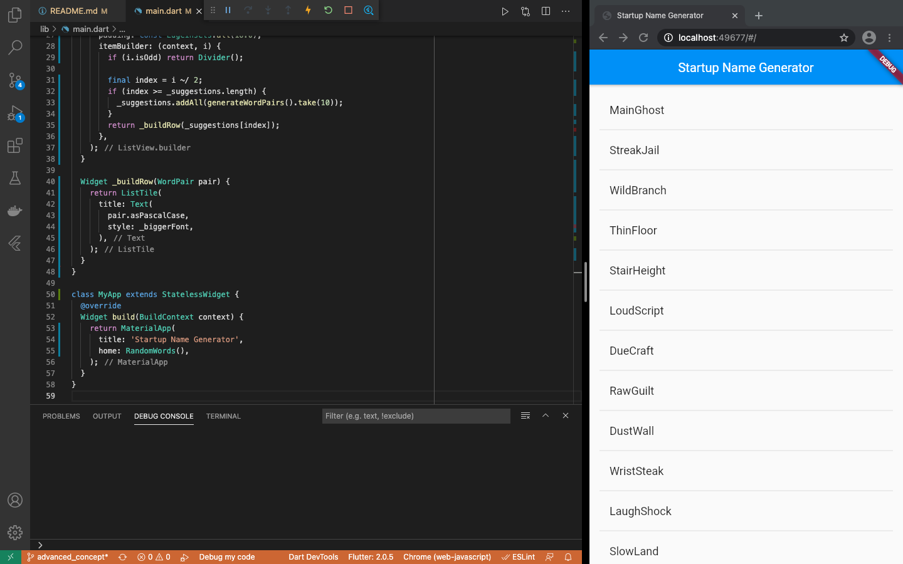
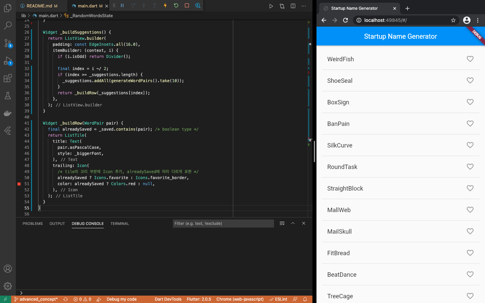
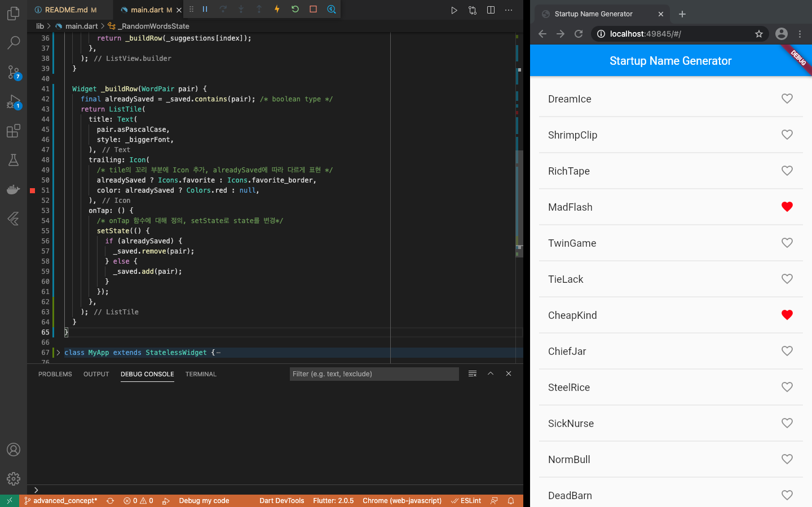
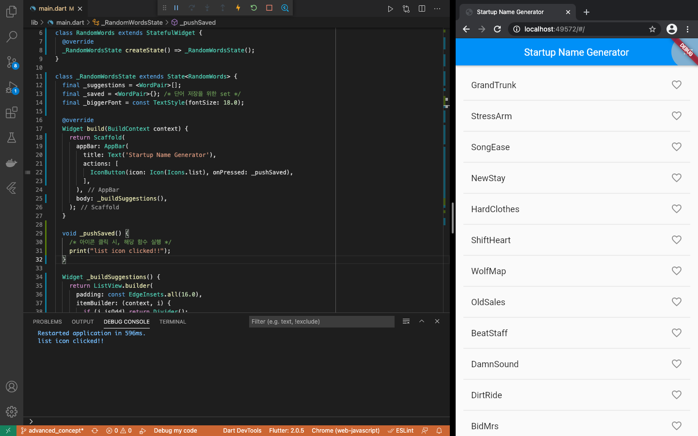
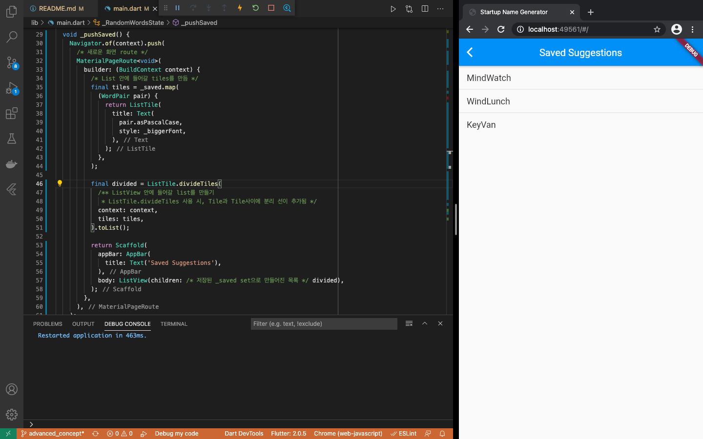
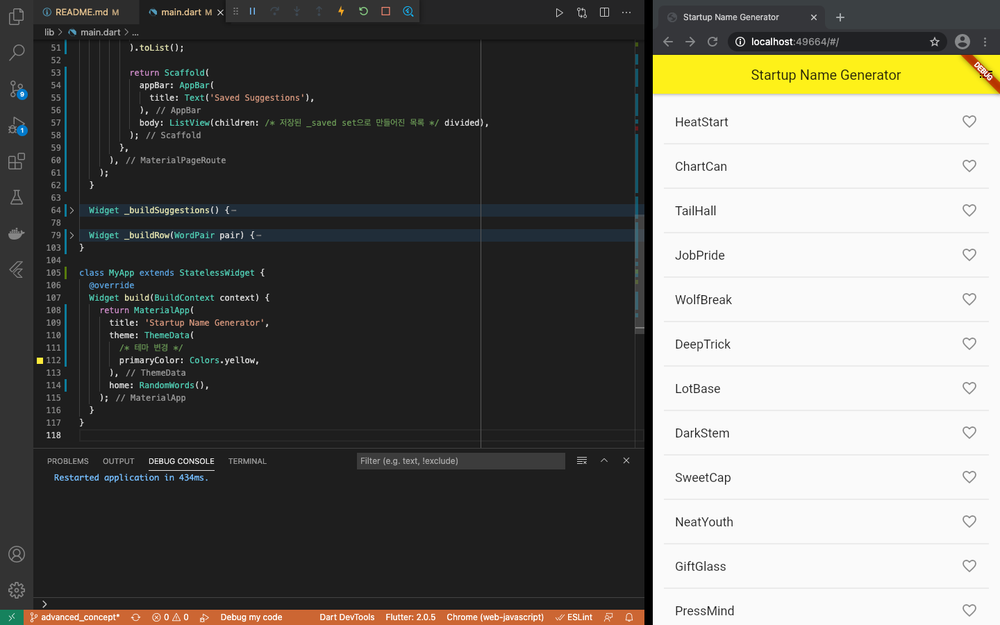

# advanced_concept_flutter
- Flutter의 추가 학습을 위해 작성한 프로젝트

## To Do
- [Google Developers Codelab (Write Your First Flutter App, part 2)](https://codelabs.developers.google.com/codelabs/first-flutter-app-pt2#0)를 학습한 결과물

1. 클릭 가능한 하트 아이콘을 추가, 단어를 저장하는 상호작용 만들기
2. 저장한 단어를 보관하는 화면과 경로를 추가, 화면으로 이동하는 내비게이션 기능(Flutter에서 route라 함) 구현
3. 앱 테마 색을 수정하기

## Get the starting app
- codelab1 에서 작성한 코드를 가져오기 (주석 제거)
- [basic_concept_flutter](../basic_concept_flutter) 프로젝트
  - [main.dart](../basic_concept_flutter/lib/main.dart)
  - [pubspec.yaml](../basic_concept_flutter/pubspec.yaml)
- 실행 결과
<br><br>

## Add icons to the list
- _RandomWordsState 수정
- 각 행에 하트 Icon 추가
  - 현재 상태(alreadySaved)에 따라 Icon을 다르게 표현
- _saved Set에 현재 상태를 저장할 예정
  - 중복을 허용하지 않아야함으로 set이 적당함 
```dart
class _RandomWordsState extends State<RandomWords> {
  final _suggestions = <WordPair>[];
  final _saved = <WordPair>{}; /* 단어 저장을 위한 set */
  final _biggerFont = const TextStyle(fontSize: 18.0);

  /* build... */
  /* _buildSuggestions... */

  Widget _buildRow(WordPair pair) {
    final alreadySaved = _saved.contains(pair); /* boolean type */
    return ListTile(
      title: Text(
        pair.asPascalCase,
        style: _biggerFont,
      ),
      trailing: Icon(
        /* tile의 꼬리 부분에 Icon 추가, alreadySaved에 따라 다르게 표현 */
        alreadySaved ? Icons.favorite : Icons.favorite_border,
        color: alreadySaved ? Colors.red : null,
      ),
    );
  }
}
```
- 실행 결과
<br><br>

## Add interactivity
- 방금 추가한 Icon에 상호작용 추가
  - ListTile을 생성하는 함수(_buildRow)에 onTap 속성 (함수)추가
  - setState 실행 시 프레임워크(flutter)에 state가 변경되었음을 알림
- 저장되지 않은 상태에서 ListTile과 상호작용 -> set에 해당 단어를 추가
- 저장된 상태에서 ListTile과 상호작용 -> set에 해당 단어를 제거
```dart
Widget _buildRow(WordPair pair) {
  final alreadySaved = _saved.contains(pair); /* boolean type */
  return ListTile(
    title: Text(
      pair.asPascalCase,
      style: _biggerFont,
    ),
    trailing: Icon(
      /* tile의 꼬리 부분에 Icon 추가, alreadySaved에 따라 다르게 표현 */
      alreadySaved ? Icons.favorite : Icons.favorite_border,
      color: alreadySaved ? Colors.red : null,
    ),
    onTap: () {
      /* onTap 함수에 대해 정의, setState로 state를 변경*/
      setState(() {
        if (alreadySaved) {
          _saved.remove(pair);
        } else {
          _saved.add(pair);
        }
      });
    },
  );
}
```
- Tip
```
In Flutter's reactive style framework, calling setState() triggers a call to the build() method for the State object, resulting in an update to the UI.
```
- 실행 결과
<br><br>

## Navigate to a new screen
- 저장된 단어를 보여주는 화면(route) 생성하는 것이 목적
- Flutter에서 Navigator는 stack으로 앱의 화면들(routes)을 관리
  - Navigator stack에 화면(route)을 넣으면(push) 방금 넣은 화면(route)으로 표현됨
  - Navigator stack에서 화면(route)을 빼면(pop) 이전 화면(route)으로 표현됨
  - stack의 가장 상위에 있는 화면(route)로 표현

### add actions to appBar Icon
- appbar에 list icon을 생성, 클릭 시 _pushSaved 함수 실행
- _RandomWordsState의 build 부분에서 이를 구현
```dart
@override
Widget build(BuildContext context) {
  return Scaffold(
    appBar: AppBar(
      title: Text('Startup Name Generator'),
      actions: [
        IconButton(icon: Icon(Icons.list), onPressed: _pushSaved),
      ],
    ),
    body: _buildSuggestions(),
  );
}

void _pushSaved() {
  /* 아이콘 클릭 시, 해당 함수 실행 */
  print("list icon clicked!!");
}
```
- Tip
```
Some widget properties take a single widget (child), and other properties, such as action, take an array of widgets (children), as indicated by the square brackets ([]).
```
- 중간 실행 결과(아이콘 클릭 시, 해당 함수 실행 여부 확인)
<br><br>

### push route to Navigator's stack 
- _pushSaved 함수에서 Navigator stack에 화면(route)를 넣기(Navigator.push)
  - 이로 인해 stack의 최상단 route가 변경되고 화면이 변경됨
```dart
void _pushSaved() {
  /* 아이콘 클릭 시, 해당 함수 실행 */
  print("list icon clicked!!");
  Navigator.of(context).push(/* 새로운 화면 route */);
}
```
- MaterialPageRoute's builder(익명 함수) 속성을 이용하여 화면의 content(Scaffold)를 빌드
  - stack에 push할 route 만들기
```dart
void _pushSaved() {
  Navigator.of(context).push(/* 새로운 화면 route */
    MaterialPageRoute<void>(
      builder: (BuildContext context) {
        return Scaffold(
          appBar: AppBar(
            title: Text('Saved Suggestions'),
          ),
          body: ListView(children: /* 저장된 _saved set으로 만들어진 목록 */ []),
        );
      },
    ),
  );
}
```
- ListView의 내용을 _saved set으로 채워 넣기
```dart
void _pushSaved() {
  Navigator.of(context).push(
    /* 새로운 화면 route */
    MaterialPageRoute<void>(
      builder: (BuildContext context) {
        /* List 안에 들어갈 tiles를 만듬 */
        final tiles = _saved.map(
          (WordPair pair) {
            return ListTile(
              title: Text(
                pair.asPascalCase,
                style: _biggerFont,
              ),
            );
          },
        );

        final divided = ListTile.divideTiles(
          /** ListView 안에 들어갈 list를 만들기
            * ListTile.divideTiles 사용 시, Tile과 Tile사이에 분리 선이 추가됨 */
          context: context,
          tiles: tiles,
        ).toList();

        return Scaffold(
          appBar: AppBar(
            title: Text('Saved Suggestions'),
          ),
          body: ListView(children: /* 저장된 _saved set으로 만들어진 목록 */ divided),
        );
      },
    ),
  );
}
```
- Tip
```
Note that the Navigator adds a "Back" button to the app bar. You did not have to explicitly implement Navigator.pop. Tap the back button to return to the home route.
```
- 실행 결과
<br><br>

## Change the UI using themes
- [ThemeData](https://api.flutter.dev/flutter/material/ThemeData-class.html) 클래스를 이용하여 앱의 전반적인 테마를 변경
```dart
class MyApp extends StatelessWidget {
  @override
  Widget build(BuildContext context) {
    return MaterialApp(
      title: 'Startup Name Generator',
      theme: ThemeData(
        /* 테마 변경 */
        primaryColor: Colors.yellow,
      ),
      home: RandomWords(),
    );
  }
}
```
- 실행 결과
<br><br>