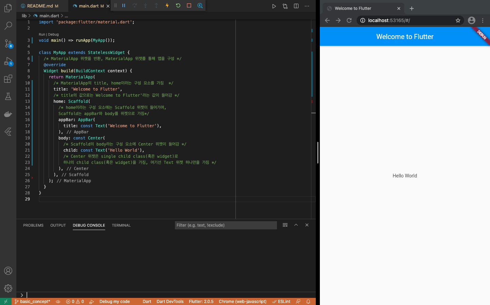
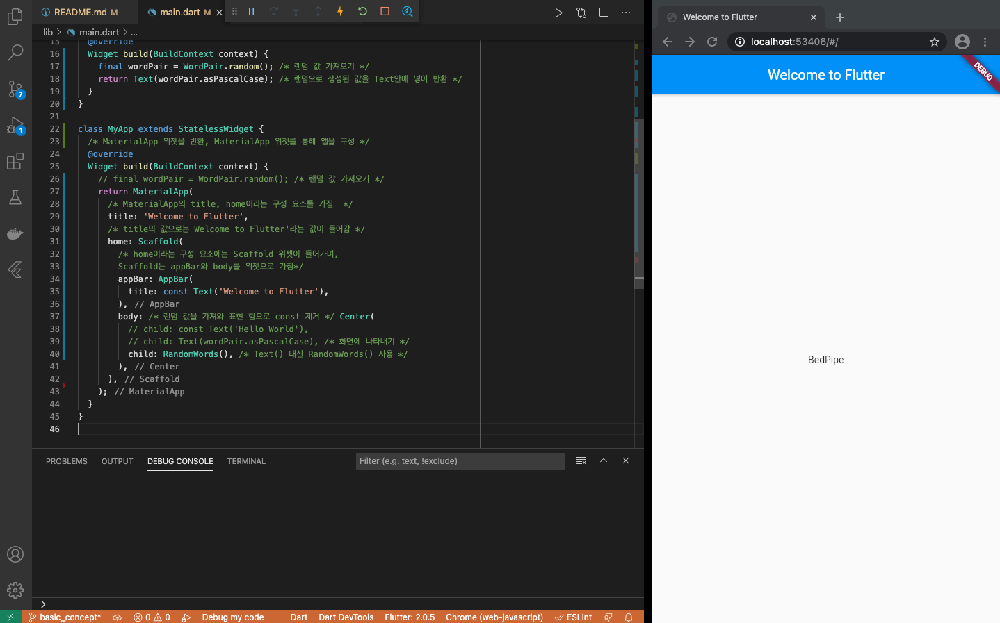
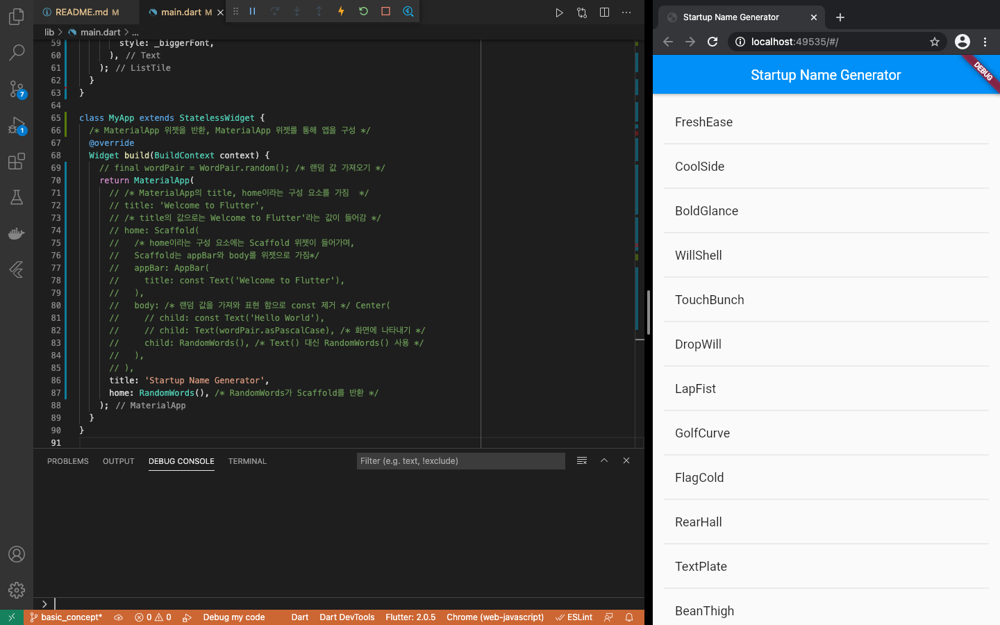

# basic_concept_flutter
- Flutter의 기본 개념을 익히기 위해 작성한 프로젝트

## To Do
- [Google Developers Codelab (Write your first Flutter app, part 1)](https://codelabs.developers.google.com/codelabs/first-flutter-app-pt1#0)를 학습한 결과물
- [flutter 웹 한글 코드랩](https://flutter-ko.dev/docs/get-started/codelab)
- [참고 링크 1](https://velog.io/@lshjh4848/%EB%82%B4%EA%B0%80-%EC%9E%98-%EB%AA%B0%EB%9E%90%EB%8D%98-Flutter-%EA%B0%9C%EB%85%90%EB%93%A4)
- [참고 링크 2](https://duzi077.tistory.com/299)

## flutter 주요 개념
- flutter에서는 정렬, 여백, 레이아웃 등 거의 모든 것이 위젯(widget)
- flutter의 시작 포인트는 void main() { runApp( ... ); } 

### Dart
- flutter는 dart라는 언어를 통해 화면과 로직을 구현
- dart는 자바와 유사하며 자바보다는 쉬움, 자바스크립트와도 유사
- 객체지향 & 함수형 프로그래밍 언어

### Material Design, App
- Material Design이란 플랫 디자인의 장점을 살리면서도 빛에 따른 종이의 그림자 효과를 이용하여 입체감을 살리는 디자인 방식 ([Wikipedia](https://ko.wikipedia.org/wiki/%EB%A8%B8%ED%8B%B0%EB%A6%AC%EC%96%BC_%EB%94%94%EC%9E%90%EC%9D%B8))
- Material Design은 모바일 및 웹에서 표준으로 사용되는 시각 디자인 언어 
- flutter는 다양한 Material Design Widget을 제공
- MaterialApp이란 Material Design을 사용할 수 있게 해주는 class
```dart
void main() => runApp(MaterialApp(home: Text('hello')));
```

### 위젯 widget
- 위젯은 flutter을 구성하는 기본 요소, 트리 형태로 위젯을 구성
- 앱은 StatelessWidget을 상속받아 앱 자체를 위젯으로 만듬
- Scaffold 위젯은 홈 스크린의 위젯 트리를 구성하는 app bar, title, body 속성을 기본으로 제공
- 위젯의 주된 임무는 다른 하위 위젯을 어떻게 표현할 지를 설명하는 build() 메서드를 제공하는 것

## Create the starter Flutter app
- flutter에서는 트리 형태의 구조로 앱의 화면을 표현함
```dart
import 'package:flutter/material.dart';

void main() => runApp(MyApp());

class MyApp extends StatelessWidget {
  /* MaterialApp 위젯을 반환, MaterialApp 위젯를 통해 앱을 구성 */
  @override
  Widget build(BuildContext context) {
    return MaterialApp(
      /* MaterialApp의 title, home이라는 구성 요소를 가짐  */
      title: 'Welcome to Flutter',
      /* title의 값으로는 Welcome to Flutter'라는 값이 들어감 */
      home: Scaffold(
        /* home이라는 구성 요소에는 Scaffold 위젯이 들어가며, 
        Scaffold는 appBar와 body를 위젯으로 가짐*/
        appBar: AppBar(
          title: const Text('Welcome to Flutter'),
        ),
        body: const Center(
          /* Scaffold의 body라는 구성 요소에 Center 위젯이 들어감 */
          child: const Text('Hello World'),
          /* Center 위젯은 single child class(혹은 widget)로 
          하나의 child class(혹은 widget)을 가짐, 여기선 Text 위젯 하나만을 가짐 */
        ),
      ),
    );
  }
}
```
- 실행 결과
<br><br>

## Use an external package
- 패키지는 pub.dev 에서 확인 가능
- english_words 패키지를 pubspec.yaml에 설치하기
- VSCode에서 Packages get을 수행하면 프로젝트로 가져온 모든 패키지 목록과 버전 번호를 포함하고 있는 pubspec.lock 파일도 자동으로 생성
```yaml
dependencies:
  flutter:
    sdk: flutter
  english_words: ^4.0.0
```
- 외부 패키지를 main.dart에 가지고 와서 사용하기
```dart
import 'package:flutter/material.dart';
import 'package:english_words/english_words.dart'; /* 외부 패키지 가져오기*/

void main() => runApp(MyApp());

class MyApp extends StatelessWidget {
  /* MaterialApp 위젯을 반환, MaterialApp 위젯를 통해 앱을 구성 */
  @override
  Widget build(BuildContext context) {
    final wordPair = WordPair.random(); /* 랜덤 값 가져오기 */
    return MaterialApp(
      /* MaterialApp의 title, home이라는 구성 요소를 가짐  */
      title: 'Welcome to Flutter',
      /* title의 값으로는 Welcome to Flutter'라는 값이 들어감 */
      home: Scaffold(
        /* home이라는 구성 요소에는 Scaffold 위젯이 들어가며, 
        Scaffold는 appBar와 body를 위젯으로 가짐*/
        appBar: AppBar(
          title: const Text('Welcome to Flutter'),
        ),
        body: /* 랜덤 값을 가져와 표현 함으로 const 제거 */ Center(
          // child: const Text('Hello World'),
          child: Text(wordPair.asPascalCase), /* 화면에 나타내기 */
        ),
      ),
    );
  }
}
```
- 실행 결과 (새로고침 시, 새로운 단어 제공)
<br><br>

## Add a stateful widget
- Stateless 위젯은 변경 불가능(immutable), 속성을 변경할 수 없으며, 모든 값이 final
- Stateful 위젯은 최소 두 개 이상 클래스가 필요 
  - 1.StatefulWidget 클래스가 2.State 클래스 의 인스턴스를 생성
  - StatefulWidget 클래스 그 자체는 변경 불가능(immutable), But State 클래스가 위젯의 수명동안 상태를 유지
- stf라고 입력 시 아래와 같은 자동 폼을 만들어줌, Stateless 위젯은 stl
```dart
class RandomWords extends StatefulWidget {
  @override
  _RandomWordsState createState() => _RandomWordsState();
}

class _RandomWordsState extends State<RandomWords> {
  @override
  Widget build(BuildContext context) {
    return Container();
  }
}
``` 
- main.dart에서 RandomWords 사용
  - 여기서 RandomWords와 _RandomWordsState 하는 일은 결국 랜덤 값을 넣은 Text 위젯을 반환하는 것
  - dart에서 클래스, 함수 명 앞에 _ 를 붙여 사용하면 private하게 인식 
```dart
import 'package:flutter/material.dart';
import 'package:english_words/english_words.dart'; /* 외부 패키지 가져오기*/

void main() => runApp(MyApp());

class RandomWords extends StatefulWidget {
  /* RandomWords 라는 StatefulWidget을 만들고 _RandomWordsState을 생성 */
  @override
  _RandomWordsState createState() => _RandomWordsState();
}

class _RandomWordsState extends State<RandomWords> {
  /* State클래스 상속 */
  @override
  Widget build(BuildContext context) {
    final wordPair = WordPair.random(); /* 랜덤 값 가져오기 */
    return Text(wordPair.asPascalCase); /* 랜덤으로 생성된 값을 Text안에 넣어 반환 */
  }
}

class MyApp extends StatelessWidget {
  /* MaterialApp 위젯을 반환, MaterialApp 위젯를 통해 앱을 구성 */
  @override
  Widget build(BuildContext context) {
    // final wordPair = WordPair.random(); /* 랜덤 값 가져오기 */
    return MaterialApp(
      /* MaterialApp의 title, home이라는 구성 요소를 가짐  */
      title: 'Welcome to Flutter',
      /* title의 값으로는 Welcome to Flutter'라는 값이 들어감 */
      home: Scaffold(
        /* home이라는 구성 요소에는 Scaffold 위젯이 들어가며, 
        Scaffold는 appBar와 body를 위젯으로 가짐*/
        appBar: AppBar(
          title: const Text('Welcome to Flutter'),
        ),
        body: /* 랜덤 값을 가져와 표현 함으로 const 제거 */ Center(
          // child: const Text('Hello World'),
          // child: Text(wordPair.asPascalCase), /* 화면에 나타내기 */
          child: RandomWords(), /* Text() 대신 RandomWords() 사용 */
        ),
      ),
    );
  }
}
```
- 실행 결과 (새로고침 시, 새로운 단어 제공)
<br><br>

## Create an infinite scrolling ListView
- RandomWordsState를 확장하여 한 단어가 아닌, 단어의 목록(ListVieW)을 생성하고 표시하는 것이 목적
- 필요에 따라 lazy한 방식으로 사용자가 스크롤할 때마다 목록을 생성
- _buildSuggestions() 함수로 ListView를 만들기
  - [ListView 클래스](https://api.flutter.dev/flutter/widgets/ListView-class.html)는 builder (팩토리 생성자) 사용, 속성인 itemBuilder를 제공
  - itemBuilder는 인자가 두개인 콜백 함수를 필요로 하며, 단어가 제안될 때마다 호출 & 각각을 ListTile 행에 배치
  - BuildContext와 행 반복자 i, 반복자는 0부터 시작되고 함수가 호출될 때마다 증가
  - 홀수 행인 경우 시각적으로 각 항목을 구분하는 Divider 위젯을 추가
  - [Divider 클래스](https://api.flutter.dev/flutter/material/Divider-class.html)는 두 단어 간 구분을 위해 사용됨
  - 짝수 행인 경우 ListTile 행에 단어 쌍을 추가
  - [ListTile 클래스](https://api.flutter.dev/flutter/material/ListTile-class.html)는 ListView의 구성 요소로써 사용됨
  - 이 방식을 사용하여 사용자가 스크롤을 할 때마다 목록이 무한하게 증가할 수 있게 함
- [소스 코드](lib/main.dart) 참고
- 실행 결과 (하단 스크롤 시, 새로운 단어 제공)
<br><br>