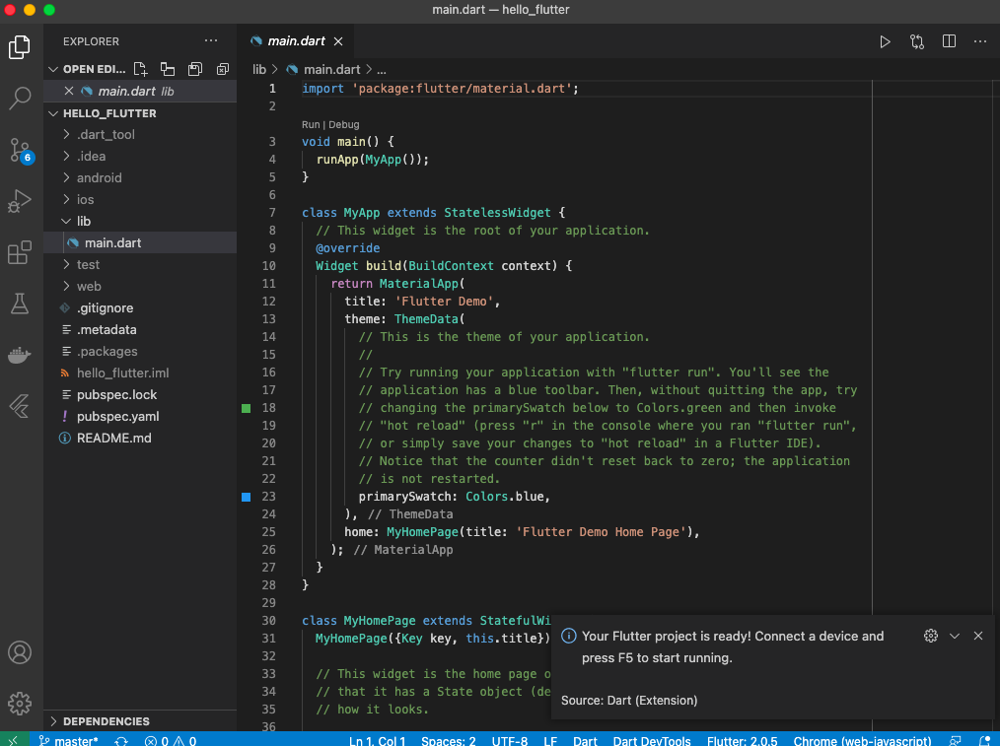

# basic_concept_flutter
- Flutter의 기본 개념을 익히기 위해 작성한 프로젝트

## flutter 기본 개념
- 자바와 유사하며 자바보다는 쉬움, 자바스크립트와도 유사
- 객체지향 & 함수형 프로그래밍 언어
- 모든 것이 위젯(widget)으로 구성
- flutter는 기본적으로 Material Design을 사용
- Material Design이란 플랫 디자인의 장점을 살리면서도 빛에 따른 종이의 그림자 효과를 이용하여 입체감을 살리는 디자인 방식 ([Wikipedia](https://ko.wikipedia.org/wiki/%EB%A8%B8%ED%8B%B0%EB%A6%AC%EC%96%BC_%EB%94%94%EC%9E%90%EC%9D%B8))
- MaterialApp이란 Material Design을 사용할 수 있게 해주는 class 

- 코드 저장 시 자동으로 내용이 정렬됨 

## 
- flutter의 시작 포인트는 void main() { runApp( ... ); } 

## 로컬PC의 폰트와 이미지 사용하기

- [참고 링크1](https://velog.io/@lshjh4848/%EB%82%B4%EA%B0%80-%EC%9E%98-%EB%AA%B0%EB%9E%90%EB%8D%98-Flutter-%EA%B0%9C%EB%85%90%EB%93%A4)

## 

1. VSCode 에서 command + Shift + P
2. Flutter: New Application Project 입력 혹은 선택
  

3. 처음 진행 시, 필요에 따라 flutter SDK 경로를 입력(Locate SDK)
  

4. SDK의 경로는 환경 설정 과정에서 sdk.zip의 압축을 푼 경로
  

5. 프로젝트 생성 폴더 선택
  

5. 프로젝트명 입력
  

6. 3.)에서 선택한 폴더 하위에 프로젝트 별로 폴더가 생성됨
  

7. VSCode가 재실행되며 프로젝트 파일이 열림
8. main.dart 파일이 자동으로 열리면 프로젝트 생성 완료
  

## 기본 앱 실행 시키기
1. main.dart에서 Run / Start Debugging 혹은 F5
  

2. 잠시 대기 후 크롬에서 flutter 기본 앱이 나오게 됨
  