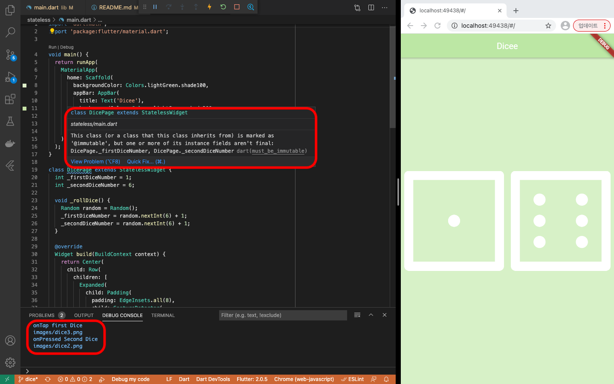
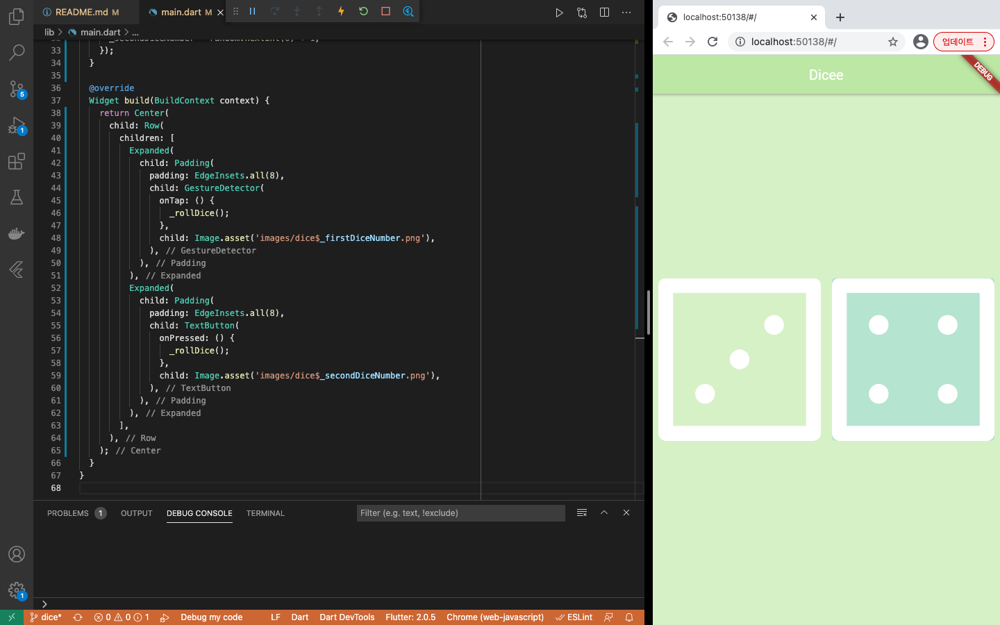

# dice_flutter
- stateful widget 생성 연습, 주사위 게임 프로젝트

## To Do
- 화면 중앙의 각각의 주사위를 클릭할 때 마다 2개의 주사위가 랜덤한 값으로 변경 

## 1. 이미지(주사위)를 화면에 나타내기
- pubspec.yaml 수정, 이미지 폴더 가져오기
```yaml
  # 해당 폴더의 자산을 사용하겠다고 명시
  assets:
    - images/
```
- main.dart에서 이미지 파일 사용(예시)
```dart 
child: Image.asset('images/dice1.png'),
```

## 2. 이미지에 클릭 가능한 이벤트(함수) 만들기
- GestureDetector의 onTap 혹은 TextButton의 onPressed 속성 함수
```dart               
GestureDetector(
  onTap: () {
    _rollDice();// onTap 되었을 때, _rollDice() 실행
  },
  child: Image.asset('images/dice$_firstDiceNumber.png'),
),
// 혹은
TextButton(
  onPressed: () {
    _rollDice();// onPressed 되었을 때, _rollDice() 실행
  },
  child: Image.asset('images/dice$_secondDiceNumber.png'),
),
```

## 3. 랜덤한 변수 생성하기
- flutter에서 제공하는 math 라이브러리를 이용
```dart
import 'dart:math';

Int makeRandomIntExample() {
  Random random = Random();
  return random.nextInt(6)+1; // 1 ~ 6 random return
}
// nextInt : Generates a non-negative random integer uniformly distributed in the range from 0, inclusive, to [max], exclusive.
```

## 4. 랜덤 생성된 변수 값으로 주사위 이미지 변경
- [읽을거리](https://itwise.tistory.com/29)

### Stateless
- stateless 위젯의 경우 한번 출력된 이후에는 화면을 변경할 수 없음
- 랜덤 값을 호출하는 것은 가능하지만 화면이 변경되지는 않음
- [Stateless 소스 코드](stateless/main.dart) 참고
<br><br>

### Stateful
- VSCode에서 'stf' 이라고 입력 시, 자동으로 Stateful입력 폼을 만들어줌 (Stateless은 stl)
- 전반적인 소스는 Stateless와 유사하나 유의미한 데이터가 변경될 경우, setState를 이용하여 변경
```dart
// <주의> setState 미사용 시, 화면이 변경되지 않음
void _rollDice() {
    Random random = Random();
    _firstDiceNumber = random.nextInt(6) + 1;
    _secondDiceNumber = random.nextInt(6) + 1;
}
// 화면이 변경됨
void _rollDice() {
  setState(() {
    Random random = Random();
    _firstDiceNumber = random.nextInt(6) + 1;
    _secondDiceNumber = random.nextInt(6) + 1;
  });
}
```
- 자세한 사항은 [Stateful 소스 코드](lib/main.dart) 참고
<br><br>