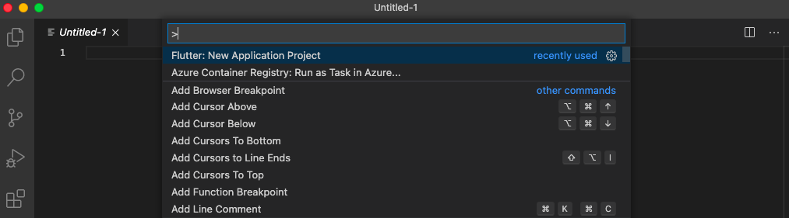
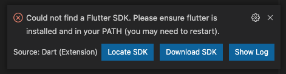
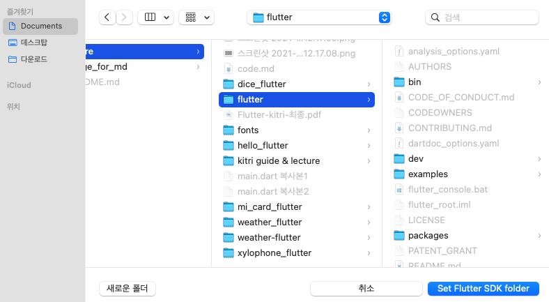
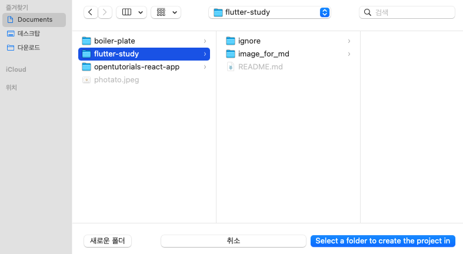
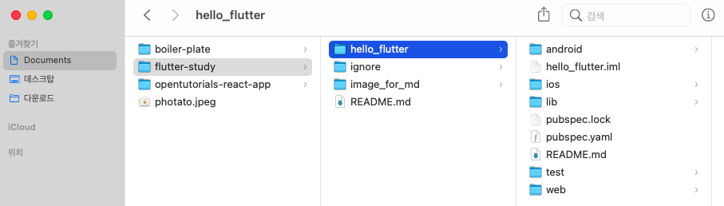
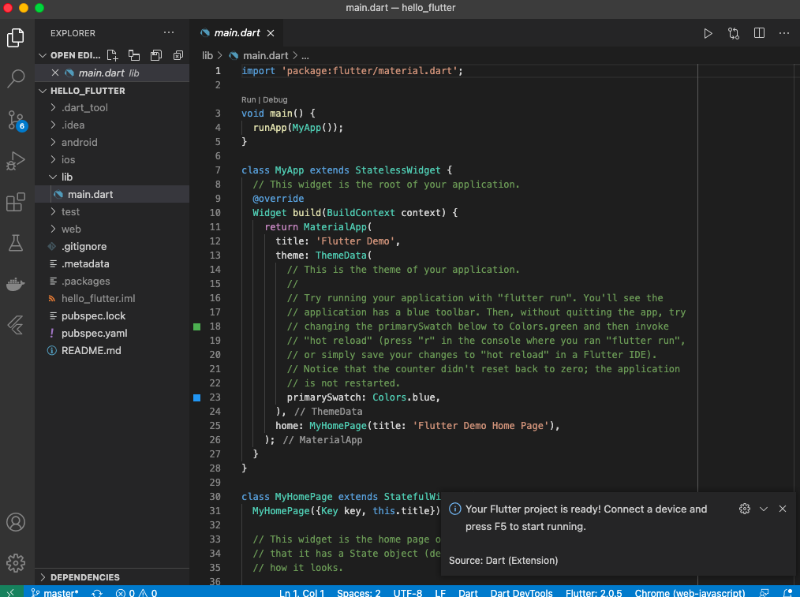
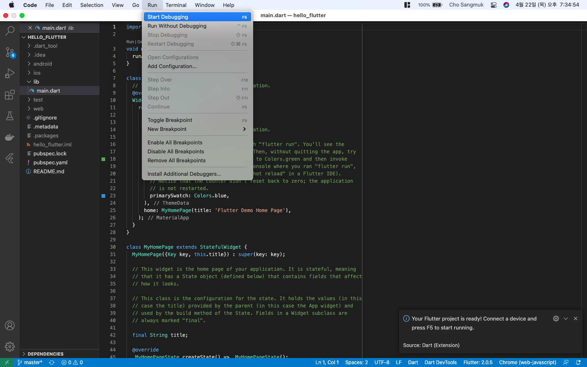
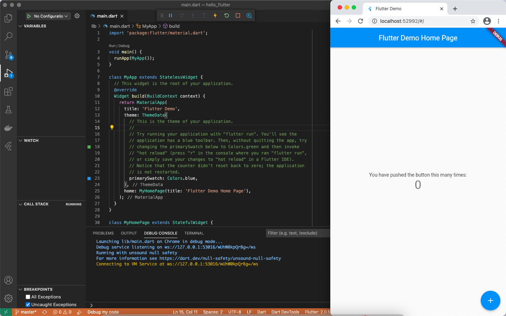

# hello_flutter
Flutter의 가장 기본이 되는 프로젝트로 이 Git 에 저장된 모든 flutter 프로젝트는 해당 프로젝트를 수정하여 발전시킨 형태

## VScode Flutter 프로젝트 생성하기
1. VSCode 에서 command + Shift + P
2. Flutter: New Application Project 입력 혹은 선택
  

3. 처음 진행 시, 필요에 따라 flutter SDK 경로를 입력(Locate SDK)
  

4. SDK의 경로는 환경 설정 과정에서 sdk.zip의 압축을 푼 경로
  

5. 프로젝트 생성 폴더 선택
  

5. 프로젝트명 입력
  

6. 3.)에서 선택한 폴더 하위에 프로젝트 별로 폴더가 생성됨
  

7. VSCode가 재실행되며 프로젝트 파일이 열림
8. main.dart 파일이 자동으로 열리면 프로젝트 생성 완료
  

## 기본 앱 실행 시키기
1. main.dart에서 Run / Start Debugging 혹은 F5
  

2. 잠시 대기 후 크롬에서 flutter 기본 앱이 나오게 됨
  