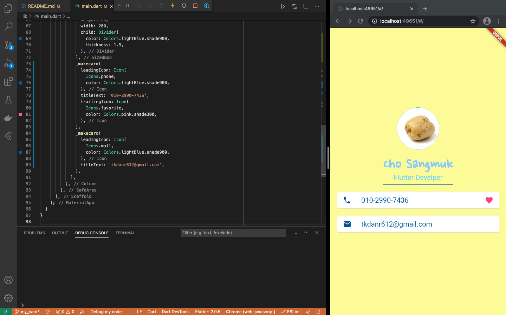

# my_card_flutter
- 로컬 PC의 폰트, 이미지 사용하기 

## 사용하게될 위젯 클래스
- [Scaffold](https://api.flutter.dev/flutter/material/Scaffold-class.html)
- [SafeArea](https://api.flutter.dev/flutter/widgets/SafeArea-class.html)
- [Column](https://api.flutter.dev/flutter/widgets/Column-class.html)
- [CircleAvatar](https://api.flutter.dev/flutter/material/CircleAvatar-class.html)
- [SizedBox](https://api.flutter.dev/flutter/widgets/SizedBox-class.html)
- [Text](https://api.flutter.dev/flutter/dart-html/Text-class.html)
- [Card](https://api.flutter.dev/flutter/material/Card-class.html)
- [ListTile](https://api.flutter.dev/flutter/material/ListTile-class.html)
- [Icon](https://api.flutter.dev/flutter/widgets/Icon-class.html)

## pubspec.yaml 수정
```yaml
# 해당 폴더의 자산을 사용하겠다고 명시
  assets:
    - assets/

# 해당 폰트를 가져오도록 정의
  fonts:
    - family: NanumPenScript
      fonts:
        - asset: fonts/NanumPenScript-Regular.ttf
```

## 불러온 파일을 main.dart에서 사용
```dart
// 이미지 사용
  backgroundImage: AssetImage('potato.jpeg'),

// 폰트 사용
  style: TextStyle(
    fontFamily: 'NanumPenScript',
    fontWeight: FontWeight.bold,
    fontSize: 40.0,
    color: Colors.blue.shade200,
  ),
```

- 자세한 사항은 [소스 코드](lib/main.dart) 참고
<br><br>