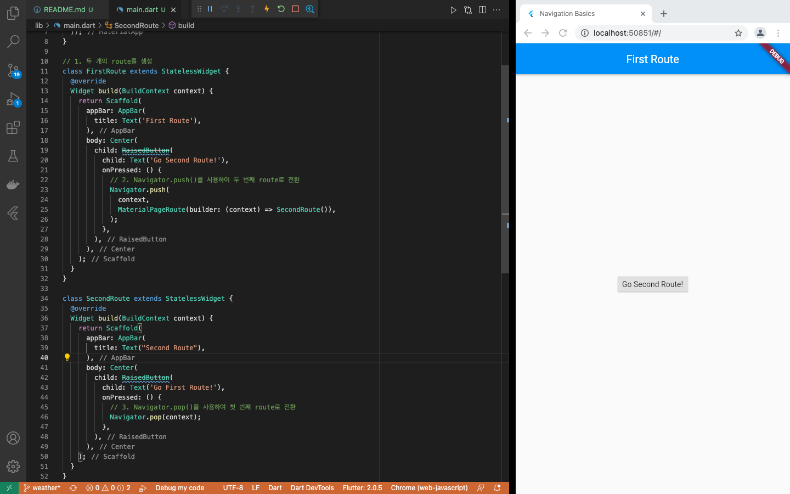
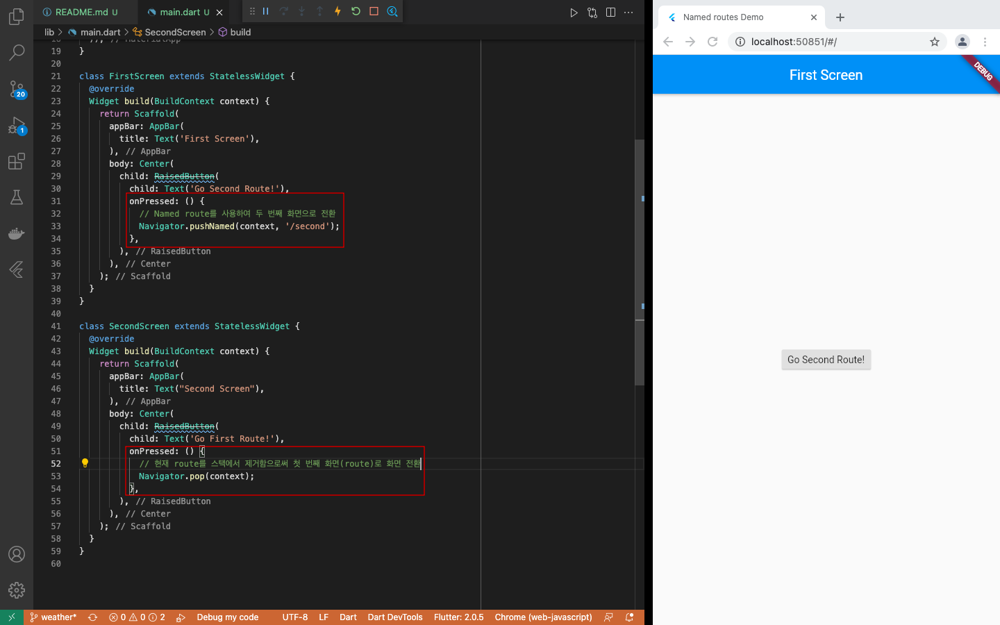

# navigation_flutter
- 네비게이션을 통한 화면 이동 예제

## ToDo
- [새로운 화면으로 이동하고, 되돌아오기](https://flutter-ko.dev/docs/cookbook/navigation/navigation-basics)
- [Named route로의 화면 전환](https://flutter-ko.dev/docs/cookbook/navigation/named-routes)
- [인자를 named route로 전달하기](https://flutter-ko.dev/docs/cookbook/navigation/navigate-with-arguments)
- [이전 화면에 데이터 반환하기](https://flutter-ko.dev/docs/cookbook/navigation/returning-data)
- [새로운 화면으로 데이터 보내기](https://flutter-ko.dev/docs/cookbook/navigation/passing-data)

## 새로운 화면으로 이동하고, 되돌아오기
- Flutter에서 screen 과 page (화면)는 route 로 불리움
```dart
import 'package:flutter/material.dart';

void main() {
  runApp(MaterialApp(
    title: 'Navigation Basics',
    home: FirstRoute(),
  ));
}

// 1. 두 개의 route를 생성
class FirstRoute extends StatelessWidget {
  @override
  Widget build(BuildContext context) {
    return Scaffold(
      appBar: AppBar( title: Text('First Route'), ),
      body: Center(
        child: RaisedButton(
          child: Text('Go Second Route!'),
          onPressed: () {
            // 2. Navigator.push()를 사용하여 두 번째 route로 전환
            Navigator.push(
              context,
              MaterialPageRoute(builder: (context) => SecondRoute()),
            );
          },
        ),
      ),
    );
  }
}

class SecondRoute extends StatelessWidget {
  @override
  Widget build(BuildContext context) {
    return Scaffold(
      appBar: AppBar( title: Text("Second Route"), ),
      body: Center(
        child: RaisedButton(
          child: Text('Go First Route!'),
          onPressed: () {
            // 3. Navigator.pop()을 사용하여 첫 번째 route로 전환
            Navigator.pop(context);
          },
        ),
      ),
    );
  }
}
```
- 실행 결과 (버튼 클릭(tab)시 화면 이동)
<br><br>

### 한걸음 더
- push, pop 이라는 메소드를 사용하는 것으로 보아 Navigator에는 route를 관리하는 stack이 있고, 해당 stack의 가장 최상위에 있는 route를 사용자에게 보여주는 것이 아닐까...? -> [Navigator Class](https://api.flutter.dev/flutter/widgets/Navigator-class.html)
```
A widget that manages a set of child widgets with a stack discipline.
```

## Named route로의 화면 전환
- 앱의 다른 많은 부분들에서 동일한 화면으로 이동하고자 한다면, 중복된 코드가 발생함
- named route를 정의하여 특정 화면으로 전환하는 방법이 있음
```dart
import 'package:flutter/material.dart';

void main() {
  runApp(MaterialApp(
    title: 'Named routes Demo',
    // initialRoute 프로퍼티는 앱의 시작점을 나타내는 route를 정의
    // "/"을 앱이 시작하게 될 route로 지정, 본 예제에서는 FirstScreen 위젯이 첫 번째 페이지로 사용
    // initialRoute를 사용할때, home프로퍼티를 정의하면 오류
    initialRoute: '/',
    // Route 정의하기 - MaterialApp 생성자에 initialRoute와 routes 이름의 추가 프로퍼티를 제공하여 route를 정의
    // routes 프로퍼티는 이용가능한 named route와 해당 route로 이동했을 때 빌드될 위젯을 정의
    routes: {
      // "/" Route로 이동하면, FirstScreen 위젯을 생성
      '/': (context) => FirstScreen(),
      // "/second" route로 이동하면, SecondScreen 위젯을 생성
      '/second': (context) => SecondScreen(),
    },
  ));
}

class FirstScreen extends StatelessWidget {
  @override
  Widget build(BuildContext context) {
    return Scaffold(
      appBar: AppBar( title: Text('First Screen'), ),
      body: Center(
        child: RaisedButton(
          child: Text('Go Second Route!'),
          onPressed: () {
            // Named route를 사용하여 두 번째 화면으로 전환
            Navigator.pushNamed(context, '/second');
          },
        ),
      ),
    );
  }
}

class SecondScreen extends StatelessWidget {
  @override
  Widget build(BuildContext context) {
    return Scaffold(
      appBar: AppBar( title: Text("Second Screen"), ),
      body: Center(
        child: RaisedButton(
          child: Text('Go First Route!'),
          onPressed: () {
            // 현재 route를 스택에서 제거함으로써 첫 번째 화면(route)로 화면 전환
            Navigator.pop(context);
          },
        ),
      ),
    );
  }
}
```
- 실행 결과 (버튼 클릭(tab)시 화면 이동)
<br><br>