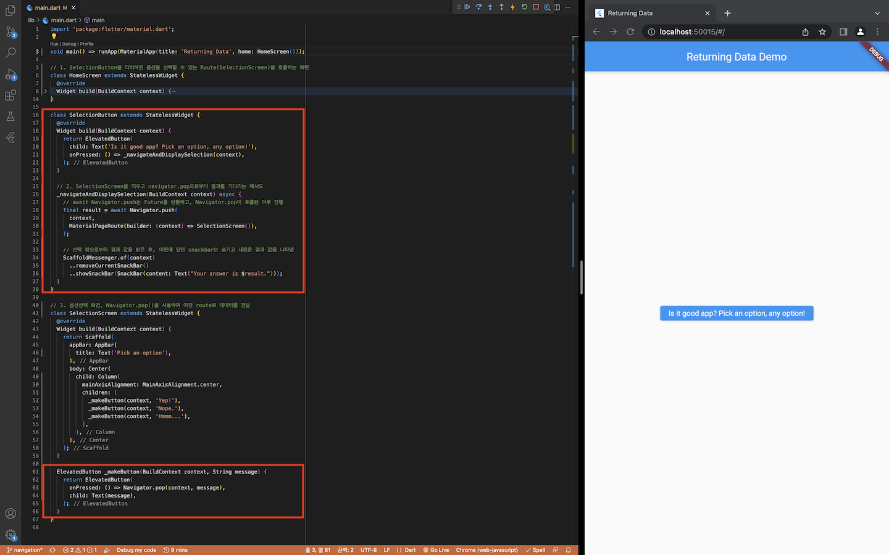

# navigation_flutter
- 네비게이션을 통한 화면 이동 예제

## ToDo
1. [새로운 화면으로 이동하고, 되돌아오기](https://flutter-ko.dev/docs/cookbook/navigation/navigation-basics)
2. [Named route로의 화면 전환](https://flutter-ko.dev/docs/cookbook/navigation/named-routes)
3. [인자를 named route로 전달하기](https://flutter-ko.dev/docs/cookbook/navigation/navigate-with-arguments)
4. [이전 화면에 데이터 반환하기](https://flutter-ko.dev/docs/cookbook/navigation/returning-data)
5. [~~새로운 화면으로 데이터 보내기~~](https://flutter-ko.dev/docs/cookbook/navigation/passing-data) -> [basic_concept_flutter : Create an infinite scrolling ListView](https://github.com/ChoSangmuk/flutter-study/tree/master/basic_concept_flutter#create-an-infinite-scrolling-listview) 참고

## 1. 새로운 화면으로 이동하고, 되돌아오기
- Flutter에서 screen 과 page (화면)는 route라함
```dart
import 'package:flutter/material.dart';

void main() {
  runApp(MaterialApp(
    title: 'Navigation Basics',
    home: FirstRoute(),
  ));
}

// 1. 두 개의 route를 생성
class FirstRoute extends StatelessWidget {
  @override
  Widget build(BuildContext context) {
    return Scaffold(
      appBar: AppBar( title: Text('First Route'), ),
      body: Center(
        child: RaisedButton(
          child: Text('Go Second Route!'),
          onPressed: () {
            // 2. Navigator.push()를 사용하여 두 번째 route로 전환
            Navigator.push(
              context,
              MaterialPageRoute(builder: (context) => SecondRoute()),
            );
          },
        ),
      ),
    );
  }
}

class SecondRoute extends StatelessWidget {
  @override
  Widget build(BuildContext context) {
    return Scaffold(
      appBar: AppBar( title: Text("Second Route"), ),
      body: Center(
        child: RaisedButton(
          child: Text('Go First Route!'),
          onPressed: () {
            // 3. Navigator.pop()을 사용하여 첫 번째 route로 전환
            Navigator.pop(context);
          },
        ),
      ),
    );
  }
}
```
<br><br>

## 2. Named route로의 화면 전환
- 앱의 다른 많은 부분들에서 동일한 화면으로 이동하고자 한다면, 중복된 코드가 발생
- 사전에 named route를 정의(MaterialApp.routes)하여 특정 화면으로 전환
```dart
import 'package:flutter/material.dart';

void main() {
  runApp(MaterialApp(
    title: 'Named routes Demo',
    // initialRoute 프로퍼티는 앱의 시작점을 나타내는 route를 정의
    // "/"을 앱이 시작하게 될 route로 지정, 본 예제에서는 FirstScreen 위젯이 첫 번째 페이지로 사용
    // initialRoute를 사용할때, home프로퍼티를 정의하면 오류
    initialRoute: '/',
    // Route 정의하기 - MaterialApp 생성자에 initialRoute와 routes 이름의 추가 프로퍼티를 제공하여 route를 정의
    // routes 프로퍼티는 이용가능한 named route와 해당 route로 이동했을 때 빌드될 위젯을 정의
    routes: {
      // "/" Route로 이동하면, FirstScreen 위젯을 생성
      '/': (context) => FirstScreen(),
      // "/second" route로 이동하면, SecondScreen 위젯을 생성
      '/second': (context) => SecondScreen(),
    },
  ));
}

class FirstScreen extends StatelessWidget {
  @override
  Widget build(BuildContext context) {
    return Scaffold(
      appBar: AppBar( title: Text('First Screen'), ),
      body: Center(
        child: RaisedButton(
          child: Text('Go Second Route!'),
          onPressed: () {
            // Named route를 사용하여 두 번째 화면으로 전환
            Navigator.pushNamed(context, '/second');
          },
        ),
      ),
    );
  }
}

class SecondScreen extends StatelessWidget {
  @override
  Widget build(BuildContext context) {
    return Scaffold(
      appBar: AppBar( title: Text("Second Screen"), ),
      body: Center(
        child: RaisedButton(
          child: Text('Go First Route!'),
          onPressed: () {
            // 현재 route를 스택에서 제거함으로써 첫 번째 화면(route)로 화면 전환
            Navigator.pop(context);
          },
        ),
      ),
    );
  }
}
```
<br><br>

## 3. 인자를 named route로 전달하기
- Navigator.pushNamed(.., parameter)를 통해 named route에게 arguments를 전달할 수 있음
- ModalRoute.of() 혹은 onGenerateRoute()의 내부에서 arguments를 추출할 수 있음
  - onGenerateRoute() 을 통한 인자전달 예제는 생략
```dart
import 'package:flutter/material.dart';

void main() => runApp(MaterialApp(
      title: 'Navigation with Arguments',
      initialRoute: '/',
      routes: {
        // Route 정의하기 - MaterialApp 생성자에 initialRoute와 routes 이름의 추가 프로퍼티를 제공하여 route를 정의
        '/': (context) => SenderScreen(),
        // '/receiverScreen': (context) => ReceiverScreen(),
        ReceiverScreen.routeName: (context) => ReceiverScreen(),
      },
    ));

// 1. Route간 전달할 인자값 정의
class ScreenArguments {
  final String title;
  final String message;

  ScreenArguments(this.title, this.message);
}

// 2. ModalRoute 로 부터 인자 값을 추출하고 표시하는 화면
class ReceiverScreen extends StatelessWidget {
  static const routeName = '/receiverScreen';

  @override
  Widget build(BuildContext context) {
    // ModalRoute.of 메소드를 통해 현재 ModalRoute의 설정을 추출하여 ScreenArguments로 저장
    final ScreenArguments args = ModalRoute.of(context).settings.arguments;

    return Scaffold(
      appBar: AppBar(title: Text(args.title),),
      body: Center(child: Text(args.message),),
    );
  }
}

// 3. 인자값을 던지는 SenderScreen 화면 작성
class SenderScreen extends StatelessWidget {
  @override
  Widget build(BuildContext context) {
    return Scaffold(
      appBar: AppBar(title: Text('Home Screen'),),
      body: Center(
        child: ElevatedButton(
          child: Text("Navigate to screen that extracts arguments"),
          onPressed: () {
            // Navigator.pushNamed(.., parameter)를 통해 named route에게 arguments를 전달, 이동
            Navigator.pushNamed(
              context,
              ReceiverScreen.routeName,
              arguments: ScreenArguments(
                'Extract Arguments Screen',
                'This message is extracted in the build method.',
              ),
            );
          },
        )
      ),
    );
  }
}
```
<br><br>

## 4. 이전 화면에 데이터 반환하기
- Navigator.pop(context, data)에 2번째 인자값(data)을 사용하여 이전 route로 데이터를 전달 가능
- async, await 를 통해 이전 화면이 종료될때까지 기다렸다가 받은 데이터를 snackbar에 표시
  - async, await 가 없는 경우 화면이 나타나는 동시에 snackbar에 의미 없는 값이 표시됨
```dart
import 'package:flutter/material.dart';

void main() => runApp(MaterialApp(title: 'Returning Data', home: HomeScreen()));

// 1. SelectionButton을 터치하면 옵션을 선택할 수 있는 Route(SelectionScreen)을 호출하는 화면
class HomeScreen extends StatelessWidget {
  @override
  Widget build(BuildContext context) {
    return Scaffold(
      appBar: AppBar(title: Text('Returning Data Demo'),),
      body: Center(child: SelectionButton(),),
    );
  }
}

class SelectionButton extends StatelessWidget {
  @override
  Widget build(BuildContext context) {
    return ElevatedButton(
      child: Text('Is it good app? Pick an option, any option!'),
      onPressed: () => _navigateAndDisplaySelection(context),
    );
  }

  // 2. SelectionScreen을 띄우고 navigator.pop으로부터 결과를 기다리는 메서드
  _navigateAndDisplaySelection(BuildContext context) async {
    // await Navigator.push는 Future를 반환하고, Navigator.pop이 호출된 이후 진행
    final result = await Navigator.push(
      context,
      MaterialPageRoute(builder: (context) => SelectionScreen()),
    );

    // 선택 창으로부터 결과 값을 받은 후, 이전에 있던 snackbar는 숨기고 새로운 결과 값을 나타냄
    ScaffoldMessenger.of(context)
      ..removeCurrentSnackBar()
      ..showSnackBar(SnackBar(content: Text("Your answer is $result.")));
  }
}

// 3. 옵션선택 화면, Navigator.pop()을 사용하여 이전 route로 데이터를 전달
class SelectionScreen extends StatelessWidget {
  @override
  Widget build(BuildContext context) {
    return Scaffold(
      appBar: AppBar(title: Text('Pick an option')),
      body: Center(
        child: Column(
          mainAxisAlignment: MainAxisAlignment.center,
          children: [
            _makeButton(context, 'Yep!'),
            _makeButton(context, 'Nope.'),
            _makeButton(context, 'Hmmm...'),
          ],
        ),
      ),
    );
  }

  ElevatedButton _makeButton(BuildContext context, String message) {
    return ElevatedButton(
      onPressed: () => Navigator.pop(context, message),
      child: Text(message),
    );
  }
}
```
<br><br>