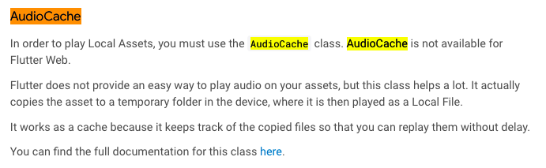

# xylophone_flutter
- 패키지 활용 연습, 실로폰 프로젝트

## To Do
- 화면에 실로폰을 나타내고, 이를 클릭(tab)할 때마다 미리 저장된 소리를 재생

## 1. 로컬 녹음 파일의 사용 명시
- pubspec.yaml 수정, 녹음 파일 폴더 가져오기
```yaml
  # 해당 폴더의 자산을 사용하겠다고 명시
  assets:
    - assets/
```

## 2. 녹음 파일 재생
- dependencies에 소리 관련 패키지 설치
```yaml
dependencies:
  # ...
  # dependencies 추가
  audioplayers: ^0.19.0
```
<br><br>

- main.dart에서 음악 파일 사용(예시)
```dart 
import 'package:audioplayers/audioplayers.dart';
//...
void _playSound(int noteId) {
  AudioCache player = AudioCache();
  player.play('녹음 파일 이름');
}
```
<br><br>

## 3. 클릭 가능한 이벤트(함수)
- GestureDetector의 onTap 혹은 TextButton의 onPressed 속성 함수를 이용
```dart
TextButton(
  onPressed: () {
    // onPressed 되었을 때, _playSound() 실행
    _playSound(noteId);
  },
  style: ButtonStyle(backgroundColor: MaterialStateProperty.all(color)),
),
```
- 자세한 사항은 [Stateful 소스 코드](lib/main.dart) 참고
<br><br>